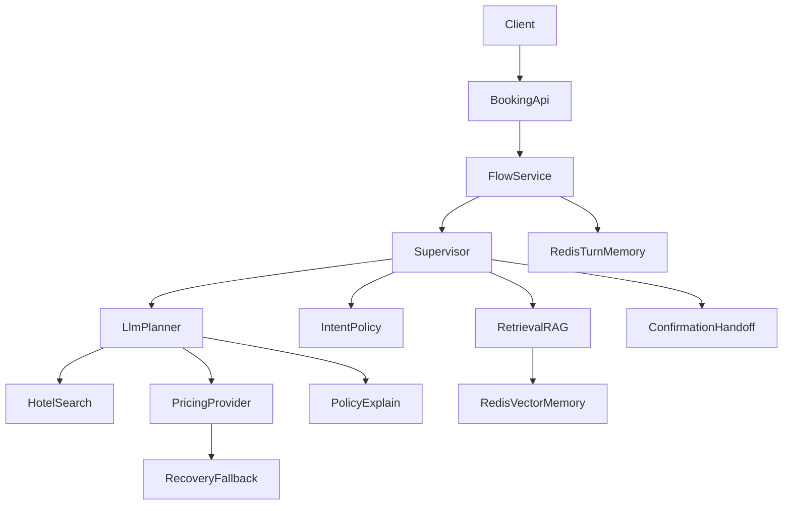

# Hotel Booking Agent - Complete System Guide

This document explains the full implementation of the Agentic AI Hotel Booking system, including architecture, setup, runtime flow, APIs, troubleshooting, and operations.

## 1) What This System Does

The service is a multi-agent booking assistant that:

- accepts user booking chat turns via HTTP API
- runs safety/policy checks
- performs retrieval-augmented reasoning (RAG)
- calls pricing providers (RapidAPI, with fallback support)
- asks explicit confirmation before final handoff
- emits strict booking handoff JSON (`READY_FOR_CREATE`)

## 2) Core Architecture

The runtime uses a supervisor + worker pattern.

- **Supervisor**: routes each turn to worker agents based on policy checks and LLM planner decision.
- **Workers**:
  - `IntentPolicy` - guardrails, validation, confirmation intent
  - `RetrievalRAG` - fetches relevant policy/provider/session context
  - `HotelSearch` - suggests hotels when `hotelId` is missing
  - `PricingProvider` - retrieves preview price and cancellation info
  - `RecoveryFallback` - recovers from provider failures (date suggestions/fallback preview)
  - `ConfirmationHandoff` - emits final JSON payload for create flow

### High-level flow



## 3) Project Structure

- `src/main/java/com/enterprise/booking/api`
  - API controllers (`/api/booking/turn`, health, traces)
- `src/main/java/com/enterprise/booking/service`
  - flow service, supervisor service, dependency health, trace service
- `src/main/java/com/enterprise/booking/agent`
  - shared agent contracts and planner
- `src/main/java/com/enterprise/booking/agent/worker`
  - worker implementations
- `src/main/java/com/enterprise/booking/rag`
  - RAG ingestion/retrieval and session memory
- `src/main/java/com/enterprise/booking/tool`
  - provider clients (preview and search)

## 4) Prerequisites

- Java 21
- Maven 3.9+
- Docker (for Redis)
- OpenAI API key (for planner + embeddings)
- RapidAPI key and subscription (for live pricing/search with RapidAPI provider)

## 5) Environment Configuration

Use `.env` (loaded by `run_spring.py`).

### Required values

- `OPENAI_API_KEY`
- `RAPIDAPI_KEY` (if `PREVIEW_PROVIDER=rapidapi`)

### Main flags

- `PREVIEW_PROVIDER=rapidapi|mock`
- `PREVIEW_FALLBACK_TO_MOCK=true|false`
- `SUPERVISOR_LLM_ENABLED=true|false`

### Redis values

- `REDIS_HOST`
- `REDIS_PORT`
- `REDIS_PASSWORD` (optional)
- `REDIS_DB`

## 6) Local Run Guide

### Step A - Start Redis

```bash
docker compose up -d redis
```

### Step B - Run application

```bash
python3 run_spring.py
```

App starts on:

- `http://localhost:9020`
- Swagger UI: `http://localhost:9020/swagger-ui.html`

## 7) API Endpoints

## `POST /api/booking/turn`

Processes one user turn.

### Request example

```json
{
  "sessionId": "demo-1",
  "userMessage": "hotelId 10507360 checkin 2026-06-10 checkout 2026-06-12 for 2 adults",
  "hotelId": "10507360",
  "checkin": "2026-06-10",
  "checkout": "2026-06-12",
  "adultCount": 2
}
```

### Confirmation turn

```json
{
  "sessionId": "demo-1",
  "userMessage": "yes confirm"
}
```

### Final handoff format

```json
{
  "status": "READY_FOR_CREATE",
  "hotelId": "10507360",
  "checkin": "2026-06-10",
  "checkout": "2026-06-12",
  "adultCount": 2
}
```

## `GET /api/booking/health/agents`

Dependency readiness checks.

- `deep=false` (default): config/bean checks
- `deep=true`: live outbound checks (Redis/OpenAI/RapidAPI)

## `GET /api/booking/traces/{sessionId}?limit=50`

Returns recent trace events for a session.

Trace includes planner/worker action, success, latency, and summary message.

## 8) Agent Decision Logic

For each turn:

1. Store user message in session memory.
2. Retrieve RAG context (policy/provider/session).
3. Run intent/policy gate:
   - blocks sensitive PII
   - validates required data and formats
   - handles confirmation intent
4. LLM planner selects action:
   - `ASK_USER`
   - `HOTEL_SEARCH`
   - `PRICE`
   - `POLICY_EXPLAIN`
5. Run selected worker.
6. On pricing errors, run recovery/fallback worker.
7. Store assistant response and traces.

## 9) Safety Rules Enforced

- No card/CVV/government ID in chat
- Relative dates require explicit `YYYY-MM-DD`
- Checkout must be after checkin
- Explicit confirmation required before final handoff
- Final handoff uses strict JSON shape

## 10) RAG and Redis Behavior

- Startup ingestion seeds policy/provider docs into Redis vector index.
- Text chunks are embedded using OpenAI embeddings.
- Retrieval uses cosine similarity + score threshold (`agent.rag.min-score`).
- Turn history is stored in Redis lists (`session:turns:*`).

## 11) Provider and Fallback Behavior

### RapidAPI mode

- preview/search provider requests are sent to configured host/base URL
- authentication errors and rate limits are surfaced in diagnostics

### Fallback mode

If enabled and provider is unavailable/auth-limited/rate-limited:

- system can return local fallback preview estimate
- recovery agent can suggest alternative date ranges

## 12) Observability

- Structured supervisor route logs:
  - `supervisor_route`
  - `finalization_gate`
- Redis trace stream per session:
  - planner action
  - worker latency
  - success/failure summaries

## 13) Testing

Run:

```bash
mvn test
```

Tests include:

- policy/validation worker behavior
- pricing worker success/failure
- confirmation handoff payload generation
- flow service delegation + memory writes

## 14) Common Issues and Fixes

- **RapidAPI 403 not subscribed**
  - verify key/app subscription and host mapping
- **Date not available**
  - use nearer date range or accept recovery suggestions
- **OpenAI startup errors**
  - set `OPENAI_API_KEY` or disable planner for debugging
- **Redis connection errors**
  - ensure Redis container is up and env values match

## 15) Production Recommendations

- move secrets to vault/secret manager (do not store in plain `.env`)
- set strict request timeout/retry policies on provider clients
- enable centralized logs and trace retention
- add rate limiting and auth on public APIs
- add end-to-end create-booking integration behind secure backend flow

## 16) Technical Class-Level Mapping

### Entry and orchestration

- `BookingAgentController`
  - HTTP adapter for `POST /api/booking/turn`
  - maps incoming payload to `BookingTurnRequest`
- `EnterpriseBookingFlowService`
  - runtime facade for each turn
  - writes user/assistant turn memory
  - invokes `SupervisorAgentService`
- `SupervisorAgentService`
  - executes worker pipeline and planner decision
  - records trace entries with latency

### Planner and agent contracts

- `LlmSupervisorPlanner`
  - LLM-driven next-action planning (`ASK_USER`, `HOTEL_SEARCH`, `PRICE`, `POLICY_EXPLAIN`)
  - deterministic fallback when LLM unavailable/disabled
- `AgentTask`, `AgentResult`, `ConversationContext`, `SupervisorDecision`, `AgentType`
  - shared contracts across agents

### Workers

- `IntentPolicyWorkerAgent`
  - PII block, validation, confirmation detection, policy/payment intent classification
- `RetrievalRagWorkerAgent`
  - fetches facts from RAG + session memory
- `HotelSearchWorkerAgent`
  - uses hotel search tool when hotel is missing
- `PricingProviderWorkerAgent`
  - executes live preview via provider tool client
- `RecoveryFallbackWorkerAgent`
  - fallback estimate and date alternatives on provider errors
- `ConfirmationHandoffWorkerAgent`
  - returns strict final handoff JSON (+ payment-readiness draft)

### Provider clients

- `RapidApiHotelPreviewClient`
  - preview price + cancellation policy retrieval
- `RapidApiHotelSearchClient`
  - hotel suggestions by city
- `MockHotelPreviewToolClient` / `MockHotelSearchClient`
  - local deterministic alternatives

### RAG and memory

- `RagIngestionService`
  - startup ingestion of docs/rules
- `RedisRagRetrievalService`
  - embedding + cosine retrieval
- `RedisSessionMemoryService`
  - chat turn persistence in Redis
- `AgentTraceService`
  - trace persistence in Redis

## 17) Request/Response Contracts (Detailed)

## `POST /api/booking/turn`

### Request schema

```json
{
  "sessionId": "string",
  "userMessage": "string",
  "hotelId": "string | optional",
  "checkin": "YYYY-MM-DD | optional",
  "checkout": "YYYY-MM-DD | optional",
  "adultCount": "integer | optional"
}
```

### Response schema

```json
{
  "state": "DATA_COLLECTION | WAITING_FOR_CONFIRMATION | FINALIZED",
  "reply": "string"
}
```

### Example: hotel search branch

Request:

```json
{
  "sessionId": "s-city-1",
  "userMessage": "Find hotels in Amsterdam for 2 adults"
}
```

Response:

```json
{
  "state": "DATA_COLLECTION",
  "reply": "I found these options. Reply with a hotelId to continue:\n- 10507360 : ...\n- 4462291 : ..."
}
```

### Example: policy explain branch

Request:

```json
{
  "sessionId": "s-policy-1",
  "userMessage": "What is cancellation policy?"
}
```

Response:

```json
{
  "state": "DATA_COLLECTION",
  "reply": "Policy summary: ..."
}
```

### Example: preview error recovery (date unavailable)

```json
{
  "state": "DATA_COLLECTION",
  "reply": "Those dates are unavailable. Try one of these date ranges: 2026-06-17 to 2026-06-19, 2026-06-24 to 2026-06-26, 2026-07-01 to 2026-07-03"
}
```

### Example: finalization

```json
{
  "state": "FINALIZED",
  "reply": "{\n  \"status\": \"READY_FOR_CREATE\",\n  \"hotelId\": \"10507360\",\n  \"checkin\": \"2026-06-10\",\n  \"checkout\": \"2026-06-12\",\n  \"adultCount\": 2\n}"
}
```

## `GET /api/booking/health/agents`

### Response schema

```json
{
  "status": "UP | DEGRADED",
  "deepCheck": true,
  "timestamp": "ISO-8601",
  "components": {
    "redis": { "status": "UP|DOWN", "detail": "..." },
    "openai": { "status": "UP|DOWN", "detail": "..." },
    "rapidapi": { "status": "UP|DOWN", "detail": "..." }
  }
}
```

## `GET /api/booking/traces/{sessionId}?limit=50`

### Response schema

```json
[
  "{\"at\":\"...\",\"agent\":\"RETRIEVAL_RAG\",\"success\":true,\"latencyMs\":32,\"message\":\"Retrieved contextual facts.\"}",
  "{\"at\":\"...\",\"agent\":\"SUPERVISOR_PLANNER\",\"llmUsed\":true,\"action\":\"PRICE\",\"reason\":\"All required fields present\"}"
]
```

## 18) Redis Data Model

| Redis Key Pattern | Type | Contents | TTL |
| --- | --- | --- | --- |
| `rag:doc:index` | Set | document IDs in RAG index | no fixed TTL |
| `rag:doc:{id}` | Hash | `domain`, `text`, `vector` | no fixed TTL |
| `session:turns:{sessionId}` | List | `user: ...` / `assistant: ...` turns | 7 days |
| `trace:session:{sessionId}` | List | JSON trace events | 7 days |

### Vector format

- Stored as comma-separated float values in `rag:doc:{id}.vector`
- Retrieved and parsed in-memory
- Similarity computed by cosine distance

## 19) LangChain4j Technical Usage

### Chat model usage

- Bean: `ChatModel` from `OpenAiChatModel`
- Used by: `LlmSupervisorPlanner`
- Input: strict planner prompt with context fields + facts + memory
- Output: strict JSON decision

### Embedding model usage

- Bean: `EmbeddingModel` from `OpenAiEmbeddingModel`
- Used by:
  - `RagIngestionService` (index-time embeddings)
  - `RedisRagRetrievalService` (query-time embedding)

### Planner behavior

1. Build prompt from `ConversationContext`.
2. Call `chatModel.chat(prompt)`.
3. Parse JSON to planner action.
4. If parse/model fails: deterministic fallback plan.

## 20) Agent Decision Sequence (Concrete)

1. `RetrievalRAG` executes first.
2. `IntentPolicy` enforces hard constraints.
3. If confirmed -> `ConfirmationHandoff`.
4. Else planner chooses:
   - `ASK_USER` -> direct response
   - `HOTEL_SEARCH` -> search worker
   - `POLICY_EXPLAIN` -> RAG fact response
   - `PRICE` -> pricing worker
5. On pricing failure -> `RecoveryFallback`.

## 21) cURL Runbook (Full)

### Start Redis

```bash
docker compose up -d redis
```

### Start app

```bash
python3 run_spring.py
```

### Turn request

```bash
curl -X POST "http://localhost:9020/api/booking/turn" \
  -H "Content-Type: application/json" \
  -d '{
    "sessionId":"demo-1",
    "userMessage":"hotelId 10507360 checkin 2026-06-10 checkout 2026-06-12 for 2 adults",
    "hotelId":"10507360",
    "checkin":"2026-06-10",
    "checkout":"2026-06-12",
    "adultCount":2
  }'
```

### Confirm

```bash
curl -X POST "http://localhost:9020/api/booking/turn" \
  -H "Content-Type: application/json" \
  -d '{
    "sessionId":"demo-1",
    "userMessage":"yes confirm"
  }'
```

### Health

```bash
curl "http://localhost:9020/api/booking/health/agents?deep=true"
```

### Traces

```bash
curl "http://localhost:9020/api/booking/traces/demo-1?limit=50"
```

## 22) Failure Matrix

| Symptom | Likely Cause | Resolution |
| --- | --- | --- |
| `RapidAPI ... not subscribed` | key/app subscription mismatch | use subscribed app key + correct host |
| `date is not available` | provider inventory/date invalid | switch dates or use suggested ranges |
| startup error on OpenAI | missing/invalid key | set `OPENAI_API_KEY` |
| no RAG facts | Redis empty or ingestion failed | verify Redis up and startup ingestion logs |
| planner not using LLM | disabled or model unavailable | set `SUPERVISOR_LLM_ENABLED=true` and key |
