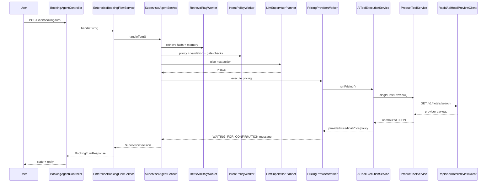

# Hotel Booking Agent - New Joiner Onboarding Guide

## 1) Product Purpose

This product is an enterprise-grade hotel booking assistant built with Spring Boot and LangChain4j.

It supports:

1. Conversational data collection for a booking request.
2. Mandatory preview-first flow before booking finalization.
3. Explicit user confirmation gate.
4. Safety controls (PII hard-stop).
5. Agentic routing (policy, hotel search, pricing, fallback, confirmation handoff).
6. RAG grounding + session memory with Redis.

The backend is designed so that user-facing booking decisions are deterministic where needed (safety, state transitions), while using LLM tool-calling for planning and product-level intelligence.

---

## 2) Core Business Rules (Non-Negotiable)

The system enforces these rules in runtime:

- Preview must happen before final handoff.
- Final booking JSON is generated only after explicit confirmation.
- Card/CVV/government ID data in chat is blocked.
- Relative dates are not accepted without exact `YYYY-MM-DD`.
- Booking cannot proceed with missing mandatory fields.

Primary enforcement class:

- `com.enterprise.booking.agent.worker.IntentPolicyWorkerAgent`

---

## 3) Full Technology Stack (What, Why, Where in Flow)

## Java + Spring Boot 3.4.5

- **What:** Core framework for API, dependency injection, configuration, lifecycle.
- **Why:** Mature enterprise runtime, easy observability and modular architecture.
- **Where used:** Whole app (`@RestController`, `@Service`, `@Configuration`, bean wiring).

## Spring Web (`spring-boot-starter-web`)

- **What:** HTTP REST layer.
- **Why:** Exposes booking, AI tool, health, and trace APIs.
- **Where used:** `BookingAgentController`, `AiToolsController`, `AgentHealthController`, `AgentTraceController`.

## Spring Validation (`spring-boot-starter-validation`)

- **What:** Request validation annotations.
- **Why:** Protects API contract from malformed requests.
- **Where used:** Request records like `AiToolsController.PricingRequest` using `@NotBlank`.

## Redis (`spring-boot-starter-data-redis`)

- **What:** In-memory data store.
- **Why:** Fast storage for conversation memory, RAG index/data, traces, and user profile hashes.
- **Where used:**
  - `RedisSessionMemoryService` -> session turns
  - `RedisRagRetrievalService` -> RAG vectors/docs
  - `AgentTraceService` -> runtime traces
  - `ProductToolService` -> user profile hash

## LangChain4j (`langchain4j`, `langchain4j-core`, `langchain4j-open-ai`)

- **What:** LLM + tool-calling framework.
- **Why:** Builds AI services with typed interfaces and `@Tool` functions.
- **Where used:**
  - `ToolCallingConfig` creates AI service beans:
    - `SupervisorToolCallingAiService`
    - `PricingToolCallingAiService`
    - `RecommendationToolCallingAiService`
    - `ProfileToolCallingAiService`
  - `SupervisorPlanningTools` provides callable tools for these services.

## OpenAI (Chat + Embedding via LangChain4j)

- **What:** Chat model + embedding model provider.
- **Why:** Chat for planning/tool orchestration, embeddings for RAG similarity.
- **Where used:**
  - `LangChainConfig.chatLanguageModel(...)`
  - `LangChainConfig.embeddingModel(...)`
  - `RedisRagRetrievalService` for query/doc vector similarity.

## RapidAPI (booking-com provider)

- **What:** External hotel data provider.
- **Why:** Real-time search/preview signals.
- **Where used:**
  - `RapidApiHotelSearchClient` -> `/v1/hotels/locations`
  - `RapidApiHotelPreviewClient` -> `/v1/hotels/search`
  - `AgentDependencyHealthService` deep probe -> `/v1/hotels/locations`

## Springdoc OpenAPI / Swagger UI

- **What:** API docs and test UI.
- **Why:** Faster onboarding/testing for developers and QA.
- **Where used:** `OpenApiConfig`, `application.yml` (`/swagger-ui.html`, `/v3/api-docs`).

## SLF4J Logging + Request Flow ID (MDC)

- **What:** Structured app logs with request-level `callId`.
- **Why:** End-to-end defect tracing across all method logs in same request.
- **Where used:**
  - `RequestFlowIdFilter` injects/propagates `X-Call-Id`.
  - `MethodLog` emits start/success/failure with args/response/purpose.
  - `logging.pattern.level` includes `[callId:%X{callId}]`.

---

## 4) Runtime Architecture

High-level pattern:

- API Controller
- Flow service
- Supervisor orchestration service
- Worker agents (specialized responsibilities)
- Tool-calling AI services and tools
- Provider clients + Redis backing services

### 4.1 Main Runtime Chain (`/api/booking/turn`)

1. `BookingAgentController.handleTurn()`
2. `EnterpriseBookingFlowService.handleTurn()`
3. `SupervisorAgentService.handleTurn()`
4. Worker execution sequence:
   - `RETRIEVAL_RAG`
   - `INTENT_POLICY`
   - planner decision
   - `HOTEL_SEARCH` or `PRICING_PROVIDER`
   - on pricing failure -> `RECOVERY_FALLBACK`
   - on confirmation -> `CONFIRMATION_HANDOFF`
5. Response returned as `BookingTurnResponse { state, reply }`

### 4.2 Worker Responsibilities

- `IntentPolicyWorkerAgent`
  - safety checks, date format checks, state gating.
- `RetrievalRagWorkerAgent`
  - fetches facts + recent memory.
- `HotelSearchWorkerAgent`
  - city extraction and top suggestions.
- `PricingProviderWorkerAgent`
  - calls pricing AI service; sets preview and state.
- `RecoveryFallbackWorkerAgent`
  - date suggestions and mock fallback when provider unavailable.
- `ConfirmationHandoffWorkerAgent`
  - outputs final `READY_FOR_CREATE` JSON and payment draft.

---

## 5) Tool-Calling AI Design

### 5.1 Why tool-calling instead of direct prompt-only generation?

- Allows controlled capabilities through named tools.
- Keeps critical operations anchored in real services.
- Reduces hallucination by forcing grounded tool outputs.

### 5.2 How tool-calling is wired

- `ToolCallingConfig` builds LangChain4j AI services.
- Each AI interface is bound to same tool class `SupervisorPlanningTools`.
- `SupervisorPlanningTools` delegates to `ProductToolService` and search client.

### 5.3 `ProductToolService` role

This class is the product intelligence hub:

- Availability alternatives
- Single preview
- Multi-hotel comparison
- Recommendations with nearby-date retries
- Currency conversion
- Cancellation estimate
- Booking create handoff payload
- User profile save/get via Redis

---

## 6) RAG + Redis Deep Dive

### 6.1 Ingestion

- `RagIngestionService` loads README + provider policy snippets.
- Upserts to Redis through `RedisRagRetrievalService.upsertDocuments(...)`.

### 6.2 Retrieval

- `RedisRagRetrievalService.retrieveFacts(sessionId, userMessage)`:
  - embeds user query
  - scans indexed vectors
  - cosine similarity scoring
  - returns top-k facts above threshold.

### 6.3 Session Memory

- `RedisSessionMemoryService` stores and retrieves latest turns per session.

### 6.4 Important Redis keys

- `rag:doc:index` -> set of doc IDs
- `rag:doc:{id}` -> hash: domain/text/vector
- `session:turns:{sessionId}` -> list of chat turns
- `trace:session:{sessionId}` -> list of trace JSON strings
- `profile:user:{userId}` -> hash for user preferences

---

## 7) RapidAPI Integration Deep Dive

## Config and auth

- Bean setup: `RapidApiConfig.rapidApiRestClient(...)`
- Headers:
  - `x-rapidapi-host`
  - `x-rapidapi-key`
- Base URL from `booking.rapidapi.base-url`

## Search path

- `RapidApiHotelSearchClient.searchByCity(city, limit)`
- Calls `/v1/hotels/locations`
- Returns destination IDs (`dest_id`) where `dest_type=city`.

## Preview path

- `RapidApiHotelPreviewClient.preview(params)`
- Calls `/v1/hotels/search` with:
  - `dest_id` (city destination id)
  - `dest_type=city`
  - check-in/out + adults.

## Error mapping

- 401/403 -> auth failure
- 400/422 -> invalid input
- 404/409 -> sold out/no availability
- 408/429/5xx -> unavailable/rate-limited/timeout class

This normalization is critical because workers and fallback logic branch on these categories.

---

## 8) Custom Pricing Logic

Class: `PricingComputationService`

Adjustments applied on provider base:

- markup percent
- fixed service fee
- optional weekend surcharge
- loyalty discount

Config block:

- `pricing.rules.enabled`
- `pricing.rules.markup-percent`
- `pricing.rules.service-fee-fixed`
- `pricing.rules.weekend-surcharge-percent`
- `pricing.rules.loyalty-discount-percent`

The adjusted final price (not just raw provider price) is used in confirmation prompts.

---

## 9) Request-Scoped Traceability and Logging

## Why this matters

Without a single flow identifier, distributed method logs are hard to correlate.

## Current implementation

- `RequestFlowIdFilter`
  - reads incoming `X-Call-Id` (optional)
  - generates one when absent
  - stores it in MDC as `callId`
  - returns `X-Call-Id` in HTTP response.
- `MethodLog`
  - emits:
    - `method_call_start`
    - `method_call_success`
    - `method_call_failure`
  - includes method purpose, args, response, elapsed time.
- `application.yml`
  - `logging.pattern.level: "%5p [callId:%X{callId}]"`

This gives end-to-end traceability from request entry to final response.

---

## 10) API Surface and Examples

## 10.1 Main conversational endpoint

### `POST /api/booking/turn`

Request:

```json
{
  "sessionId": "s1",
  "userMessage": "hotelId -553173 checkin 2026-05-10 checkout 2026-05-12",
  "hotelId": "-553173",
  "checkin": "2026-05-10",
  "checkout": "2026-05-12",
  "adultCount": 2
}
```

Response (preview stage):

```json
{
  "state": "WAITING_FOR_CONFIRMATION",
  "reply": "Preview: Provider price is CZK 3664.16, adjusted final price is CZK 3887.01. Cancellation policy: Cancellation policy is provided during final booking step. Do you confirm this booking at CZK 3887.01?"
}
```

Follow-up confirm request:

```json
{
  "sessionId": "s1",
  "userMessage": "yes confirm"
}
```

Response (final handoff):

```json
{
  "state": "FINALIZED",
  "reply": "{\n  \"status\": \"READY_FOR_CREATE\",\n  \"hotelId\": \"-553173\",\n  \"checkin\": \"2026-05-10\",\n  \"checkout\": \"2026-05-12\",\n  \"adultCount\": 2\n}"
}
```

## 10.2 Tool debug endpoints

### `POST /api/booking/ai/pricing`

```json
{
  "userGoal": "booking_preview",
  "hotelIdsCsv": "-553173",
  "checkin": "2026-05-10",
  "checkout": "2026-05-12",
  "adultCount": 2
}
```

### `POST /api/booking/ai/recommendation`

```json
{
  "city": "Dubai",
  "checkin": "2026-05-10",
  "checkout": "2026-05-12",
  "adultCount": 2,
  "maxBudget": 900
}
```

### `POST /api/booking/ai/profile`

```json
{
  "operation": "save",
  "userId": "u-123",
  "key": "preferred_city",
  "value": "Dubai"
}
```

## 10.3 Health and traces

- `GET /api/booking/health/agents`
- `GET /api/booking/health/agents?deep=true`
- `GET /api/booking/traces/{sessionId}?limit=50`

---

## 11) Configuration Reference

Core sections in `application.yml`:

- `server.port=9020`
- `spring.data.redis.*`
- `agent.llm.*` and `agent.rag.*`
- `booking.rapidapi.*`
- `preview.provider` + `preview.fallback-to-mock`
- `pricing.rules.*`
- `springdoc.*`
- `logging.*`

Minimal environment variables:

```bash
export OPENAI_API_KEY="..."
export RAPIDAPI_KEY="..."
export RAPIDAPI_HOST="booking-com.p.rapidapi.com"
export RAPIDAPI_BASE_URL="https://booking-com.p.rapidapi.com"
export REDIS_HOST="localhost"
export REDIS_PORT="6379"
```

---

## 12) End-to-End Sequence (Conceptual)



---

## 13) Troubleshooting Matrix

## Symptom: RapidAPI “not connecting”

Check:

1. `GET /api/booking/health/agents?deep=true`
2. Confirm `RAPIDAPI_KEY`, `RAPIDAPI_HOST`, `RAPIDAPI_BASE_URL`.
3. Check response category:
   - auth (401/403)
   - validation (400/422)
   - rate limit (429)
   - upstream (5xx)
   - timeout/network.

## Symptom: recommendation empty

Possible causes:

- no availability for given city/date/budget
- provider returns no usable candidates
- strict filters

Mitigations already implemented:

- deterministic fallback path
- nearby date shifts in recommendation logic
- consistent empty response schema.

## Symptom: pricing returns invalid response

Check:

- `output` JSON format from `/api/booking/ai/pricing`
- logs for `PricingProviderWorkerAgent` and `AiToolExecutionService`
- `callId` continuity across logs.

---

## 14) Development Workflow for New Joiners

1. Start Redis:

```bash
docker compose up -d redis
```

2. Run service:

```bash
mvn spring-boot:run
```

3. Open Swagger:

- `http://localhost:9020/swagger-ui.html`

4. Validate in order:

- health check
- recommendation endpoint
- pricing endpoint
- booking turn full flow.

5. Use traces:

- `GET /api/booking/traces/{sessionId}`

6. Use `X-Call-Id` header to correlate every log line in one flow.

---

## 15) Extension Guide (How to Add New Capability Safely)

When adding a new feature:

1. Decide if it belongs in a worker, tool, or provider client.
2. Add request-safe validations in `IntentPolicyWorkerAgent` if required.
3. Expose as `@Tool` in `SupervisorPlanningTools` when AI should invoke it.
4. Keep outputs strict JSON for machine-readable downstream handling.
5. Ensure fallback behavior exists for provider/LLM failure paths.
6. Add trace entries (`AgentTraceService`) for observability.
7. Keep `MethodLog` wrappers for request-level debugging.

---

## 16) Key Source File Map (Quick Navigation)

- API entry:
  - `api/BookingAgentController`
  - `api/AiToolsController`
- Flow orchestration:
  - `service/EnterpriseBookingFlowService`
  - `service/SupervisorAgentService`
- Planner:
  - `agent/LlmSupervisorPlanner`
- Workers:
  - `agent/worker/*`
- Tool layer:
  - `agent/toolcalling/SupervisorPlanningTools`
  - `agent/toolcalling/ProductToolService`
- External provider:
  - `tool/RapidApiHotelPreviewClient`
  - `tool/RapidApiHotelSearchClient`
- RAG/Redis:
  - `rag/*`
- Observability:
  - `observability/RequestFlowIdFilter`
  - `observability/MethodLog`
  - `service/AgentTraceService`

---

## 17) Final Notes for New Team Members

- Treat safety rules and confirmation gate as contractual behavior.
- Keep provider calls normalized and error-categorized.
- Prefer explicit JSON outputs over prose for internal tool paths.
- Use `callId` first whenever debugging cross-class flow defects.
- Read logs + traces together for complete diagnosis.

